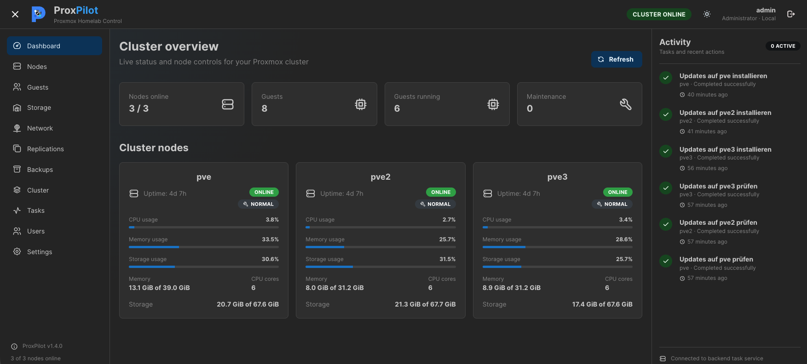

<p align="center">
  
</p>

<h1 align="center">ProxPilot</h1>

<p align="center">
A modern, lightweight web interface for monitoring and managing multiple Proxmox VE clusters, standalone hosts and homelabs.
</p>

<p align="center">
  
  
  
  
  
  
</p>

---

# Overview

ProxPilot is an open-source management interface for **Proxmox VE**.

The current 1.7.0 configuration model supports multiple independent Proxmox infrastructures from a single ProxPilot installation.

It complements the native Proxmox interface by providing a clean dashboard, simplified daily administration, integrated monitoring and commonly used management actions across multiple independent Proxmox infrastructures.

---

# Highlights

- Modern React interface
- FastAPI backend
- Docker deployment
- Local and LDAP authentication
- Integrated browser console for QEMU and LXC
- VM and LXC management
- Snapshot and backup management
- Node maintenance
- Update management
- Storage, network and cluster overview
- Multiple independent Proxmox infrastructures
- Automatic cluster and standalone-host discovery
- Integrated audit log
- Administrator, Operator and Viewer roles
- Guest Agent information
- Guest filesystem and disk usage
- ZFS health monitoring
- S.M.A.R.T. monitoring
- Improved task monitoring
- UPS monitoring through Network UPS Tools (NUT)
- Task Scheduler

---

# Screenshots

## Dashboard

<p align="center">
  
</p>

The dashboard provides an overview of the configured Proxmox infrastructures, including node status, guests, storage, resource utilization and recent activity.

---

# Architecture

```text
Browser
   │
   ▼
Reverse Proxy (optional)
   │
   ▼
Frontend (React)
   │
   ▼
Backend (FastAPI)
   ├── Infrastructure configuration
   │   ├── Proxmox Cluster A
   │   ├── Proxmox Cluster B
   │   └── Standalone Host
   ├── Proxmox API
   ├── SSH
   └── SQLite
```

---

# Quick Start

```bash
git clone https://github.com/Mauckisch/proxpilot.git
cd proxpilot
cp .env.example .env
nano .env
docker compose up -d --build
```

Configure the global application settings in `.env` before starting. After the first login, add Proxmox environments under **Settings → Infrastructure**. Proxmox endpoints, API tokens, node addresses and SSH settings are configured there rather than through `PVE_*` environment variables.

---

# Documentation

| Document | Description |
|-----------|-------------|
| docs/INSTALLATION.md | Installation |
| docs/CONFIGURATION.md | Configuration |
| docs/API-PERMISSIONS.md | Required Proxmox permissions |
| docs/AUTHENTICATION.md | Local users & LDAP |
| docs/HTTPS_AND_REVERSE_PROXY.md | HTTPS and reverse proxies |
| docs/TROUBLESHOOTING.md | Troubleshooting |
| docs/DEVELOPMENT.md | Development |

---

# Requirements

- Proxmox VE
- Docker Engine
- Docker Compose
- A Proxmox API token for each configured infrastructure
- SSH access to the Proxmox nodes for host-level functions
- Network access from the ProxPilot backend to the Proxmox API and SSH services
- Installed `lm-sensors` package on nodes where temperature monitoring is required

### Temperature Monitoring

Hardware temperature monitoring requires the `lm-sensors` package to be installed on every Proxmox node.

Install it with:

```bash
apt update
apt install -y lm-sensors
sensors-detect --auto
systemctl restart kmod
```
Once sensors are available, ProxPilot will automatically display CPU, motherboard and other hardware temperatures supported by the system.

---

# Roadmap

- Historical statistics
- Notifications
- Additional charts
- RBAC improvements

---

# Why ProxPilot?

ProxPilot was created to simplify the daily administration of Proxmox VE environments.

The official Proxmox VE interface is extremely powerful and exposes every available feature of the platform. For day-to-day administration, however, many users repeatedly navigate through the same menus to perform common tasks.

ProxPilot focuses on these everyday operations and presents them in a clean, modern interface while continuing to use the official Proxmox API and SSH.

## Design Goals

- Fast access to common operations
- Clean, responsive interface
- Safe administration
- Easy deployment with Docker
- Works with multiple independent clusters and standalone Proxmox hosts
- Modern authentication
- Open source

---

# Why not replace the Proxmox interface?

ProxPilot is **not** intended to replace the official Proxmox VE web interface.

Instead it complements it.

The official interface remains the best choice for advanced cluster configuration, storage creation, networking, firewall configuration and every feature provided by Proxmox VE.

ProxPilot focuses on operational tasks:

- Monitor cluster health
- Manage guests
- Perform maintenance
- Execute backups
- Open browser consoles for QEMU virtual machines and LXC containers
- View hardware information
- Review tasks
- Manage users and roles
- Review the audit log
- Inspect Guest Agent and guest disk usage information
- Monitor ZFS and S.M.A.R.T. health

---

# Feature Matrix

| Area | Supported |
|------|:---------:|
| Dashboard | ✅ |
| Cluster overview | ✅ |
| Node overview | ✅ |
| VM management | ✅ |
| LXC management | ✅ |
| Guest power actions | ✅ |
| Live migration | ✅ |
| Snapshots | ✅ |
| Backups | ✅ |
| Browser console (QEMU & LXC) | ✅ |
| Storage overview | ✅ |
| Network overview | ✅ |
| Replication overview | ✅ |
| HA overview | ✅ |
| Package updates | ✅ |
| Maintenance mode | ✅ |
| Hardware information | ✅ |
| Guest Agent information | ✅ |
| Guest disk usage | ✅ |
| ZFS information and health monitoring | ✅ |
| S.M.A.R.T. monitoring and warnings | ✅ |
| Temperature monitoring | ✅ |
| UPS monitoring (NUT) | ✅ |
| Local users | ✅ |
| LDAP authentication | ✅ |
| Administrator / Operator / Viewer roles | ✅ |
| Audit log | ✅ |
| Audit CSV / JSON export | ✅ |
| Task Scheduler | ✅ |
| Multiple infrastructures | ✅ |
| Multiple independent Proxmox clusters | ✅ |
| Standalone Proxmox hosts | ✅ |


---

# Detailed Features

## Dashboard

The dashboard combines the most important information from the configured Proxmox infrastructures on a single page.

Highlights include:

- Cluster summary
- Node status
- Resource utilisation
- Running guests
- Storage usage
- Recent activity
- Task Scheduler

## Multiple Infrastructures

ProxPilot can manage multiple independent Proxmox environments from one installation.

An infrastructure can be:

- a Proxmox VE cluster
- a standalone Proxmox VE host

New environments are added under **Settings → Infrastructure**. Enter one reachable API endpoint and the API token, then use **Test & Discover**. ProxPilot detects whether the endpoint belongs to a cluster or a standalone host and discovers the available nodes.

For every discovered node, the **Reachable host / IP** can be confirmed or adjusted independently. API credentials, TLS verification and SSH settings are stored per infrastructure.

This allows environments such as a production cluster, lab cluster and standalone hosts to coexist in the same ProxPilot instance. Identical node names in different infrastructures remain distinguishable through their infrastructure context.

### Task Scheduler

ProxPilot includes an integrated Task Scheduler for automated Proxmox operations.

Tasks can be configured for one-time execution or as recurring schedules using minute, hour, day, week or month intervals.

Supported scheduled operations include:

- Guest start, shutdown, stop, reboot, suspend and resume
- Guest migration
- Guest backup
- Snapshot creation and deletion
- Node update checks and update installation
- Node package cleanup
- Node reboot and shutdown
- Node maintenance mode enable and disable

Scheduled tasks run independently of interactive user sessions. Automated executions are identified as scheduler/system operations in the audit log and Activity panel.

Operators and administrators can create, modify, enable, disable, delete and manually execute scheduled tasks. Viewer accounts have read-only access.

The **Run now** action allows an existing schedule to be executed immediately without changing its configured next execution time.

The scheduler uses the timezone selected by the user's browser when tasks are created, with UTC as a neutral fallback.

## Nodes

Each node provides:

- CPU
- Memory
- Storage
- Update status
- Hardware details
- Physical disks
- ZFS pools, health and scrub information
- S.M.A.R.T. information and health warnings
- Temperatures
- Network interfaces
- UPS information through Network UPS Tools (NUT)

Administrative actions include:

- Install updates
- Package cleanup
- Maintenance mode
- Reboot
- Shutdown

## UPS Monitoring

ProxPilot can display UPS information from Network UPS Tools (NUT) on individual Proxmox nodes.

The integration uses the existing NUT netclient configuration on the host and does not require additional ProxPilot configuration.

ProxPilot automatically detects:

- `MODE=netclient`
- an active `nut-monitor` service
- configured `MONITOR` targets in `/etc/nut/upsmon.conf`

The UPS tab is only displayed when a working NUT netclient configuration is detected.

UPS information is read using the configured `upsc` target and includes all values returned by NUT, such as:

- UPS status
- Battery charge
- Battery runtime
- Load
- Output voltage
- Manufacturer and model
- Outlet information
- Driver information

UPS status values are displayed with color-coded status indicators.

## Guests

Supported operations:

- Start
- Stop
- Shutdown
- Reset
- Suspend
- Resume
- Migration
- Snapshots
- Manual backups
- Configuration viewer
- Guest Agent information
- Guest operating system
- Guest IP addresses
- Guest filesystem and disk usage information
- Integrated browser console for QEMU and LXC

## Storage

Displays:

- Total capacity
- Used capacity
- Free capacity
- Storage type
- Shared/local status
- Supported content types

## Network

Provides:

- Bridges
- Physical interfaces
- VLAN interfaces
- IPv4 and IPv6 addresses
- Interface state and link speed
- Bridge and VLAN relationships
- Guest network assignments
- Relationship visualisation

## Replication

Displays:

- Replication jobs
- Source node
- Target node
- Schedule
- Status

## Cluster & HA

Overview of:

- Cluster members
- HA resources
- Guest distribution
- Node availability

## Tasks

Task monitoring includes:

- Running tasks
- Completed tasks
- Failed tasks
- Improved task categorization
- Task duration
- Exit status
- Task log output
- Activity panel integration

## Authentication

Supports:

- Local users
- LDAP / Active Directory
- Secure session cookies
- Administrator, Operator and Viewer roles
- LDAP group-to-role mapping

## Audit Log

ProxPilot includes a built-in audit log for administrative and operational activities.

Recorded information includes:

- User
- Role
- Authentication source
- Client IP address
- Target object
- Proxmox node
- Action
- Result
- Severity
- Structured JSON details

Features include:

- Multi-select filters
- Context-aware filter values
- CSV export
- JSON export
- Configurable retention
- Automatic cleanup

Exported audit data respects the currently active filters.

## Browser Console

The integrated browser console provides direct browser access to both QEMU virtual machines and LXC containers without opening the Proxmox VE interface.

Features include:

- Integrated noVNC-based console
- Support for QEMU virtual machines
- Support for LXC containers
- Full-screen mode
- Automatic reconnect
- Remote resize
- Scale-to-fit
- Ctrl+Alt+Del (QEMU)

HTTPS is required to ensure secure WebSocket communication and Secure cookie support.

---

# Installation

The complete installation guide is available in:

- `docs/INSTALLATION.md`

Configuration details:

- `docs/CONFIGURATION.md`

Required Proxmox permissions:

- `docs/API-PERMISSIONS.md`

Authentication:

- `docs/AUTHENTICATION.md`

HTTPS and reverse proxies:

- `docs/HTTPS_AND_REVERSE_PROXY.md`

Troubleshooting:

- `docs/TROUBLESHOOTING.md`

Development:

- `docs/DEVELOPMENT.md`

---

# Project Structure

```text
proxpilot/
├── backend/
├── frontend/
├── docs/
├── ssh/
├── data/
├── docker-compose.yml
├── .env.example
├── README.md
└── CHANGELOG.md
```

---

# Documentation

| Document | Description |
|----------|-------------|
| INSTALLATION.md | Complete installation guide |
| CONFIGURATION.md | Global settings and infrastructure configuration |
| API-PERMISSIONS.md | Required Proxmox permissions |
| AUTHENTICATION.md | Local users and LDAP |
| HTTPS_AND_REVERSE_PROXY.md | Reverse proxy configuration |
| TROUBLESHOOTING.md | Common problems |
| DEVELOPMENT.md | Development and release workflow |

---

# FAQ

### Does ProxPilot replace the official Proxmox interface?

No. It complements the official interface by focusing on everyday administration.

### Is HTTPS required?

Strongly recommended.

The integrated browser console works only with HTTPS and Secure cookies.

### Is LDAP required?

No.

Local authentication works without LDAP.

### Does ProxPilot support multiple Proxmox clusters?

Yes. ProxPilot 1.7.0 supports multiple independent infrastructures in one installation. Each infrastructure can be a Proxmox VE cluster or a standalone host.

### Where are Proxmox connections configured?

Open **Settings → Infrastructure**. Proxmox API endpoints, API tokens, TLS verification, reachable node addresses and SSH settings are configured per infrastructure. The old `PVE_*` environment-variable model is no longer the normal configuration method.

### Where are users stored?

Local users are stored inside:

```text
./data/proxpilot.db
```

---

# Roadmap

Planned improvements include:

- Better charts
- Historical statistics
- Notifications
- Additional storage information
- RBAC improvements

---

# Contributing

Contributions are welcome.

Before opening an issue, include:

- ProxPilot version
- Proxmox VE version
- Docker version
- Browser
- Logs
- Reproduction steps

Never publish:

- API token secrets
- Passwords
- SSH private keys
- SQLite databases

---

# Support

Please use GitHub Issues for:

- Bug reports
- Feature requests
- Documentation improvements

---

# License

ProxPilot is licensed under the MIT License.

See `LICENSE` for details.

---

# Disclaimer

ProxPilot is an independent open-source project.

It is not affiliated with, endorsed by or supported by Proxmox Server Solutions GmbH.
